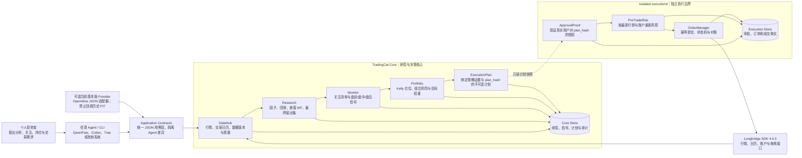

<p align="center">
  
</p>

# TradingCat

[English](README_EN.md)

TradingCat 是一个面向个人投资者的、Agent 无关的量化研究与交易决策系统。它把股票
分析、策略验证、关注监控、Kelly 仓位建议、组合风控和人工审批串成闭环，同时保持
QwenPaw、Codex、Trae 等上层 Agent 可替换。

当前默认运行模式是 **PAPER/DRY_RUN**。LIVE 软件链路已经支持“生成计划 → 请求审批 →
可信 `ApprovalProof` → executiond 执行 → 成交回报与对账”，但生产真实订单仍必须经过
独立 executiond、有效的人工 `ApprovalProof`、审批后风控、P0-A 部署验收和显式 Live Canary。
Agent 可以调用 `execute` 转发已批准的计划，但不能创建或伪造 `ApprovalProof`。

## 先从一句话开始

把仓库交给支持 Skill 的 Agent（Codex、Trae、WorkBuddy、OpenClaw 等），让它先读取根目录
`SKILL.md`。第一次使用时可以直接说：

- “TradingCat 怎么用？先只读检查环境，不要安装或修改任何东西。”
- “分析苹果公司；如果缺少数据，先告诉我需要做什么，不要自动下载。”
- “查看当前持仓和风险；不要同步账户，除非我明确同意。”
- “用 PAPER 模式演练一笔 AAPL 交易，绝不触达实盘。”
- “生成交易建议供我审批，不要批准，也不要执行。”

Agent 应先确认你的目标，说明当前能力和限制，只推荐一个下一步。安装依赖、修改 `.env`、
下载行情、运行研究、添加关注、同步账户、生成持久化计划、请求审批和执行都需要明确授权。

如果不使用 Agent，也可以从 `./tc --help`（Linux/macOS）或 `.\tc.ps1 --help`
（Windows PowerShell）开始。

## 先看懂这些状态

| 状态 | 用户含义 |
|---|---|
| `仅分析` | 只读解释，没有改变系统状态 |
| `研究不足` / `研究已验证` | 策略证据尚未满足要求 / 已通过研究门禁 |
| `PAPER` | 仅模拟，不会触达真实券商订单 |
| `NO_ACTION` | 当前没有需要执行的订单 |
| `BLOCKED` | 数据、账户、风控或对账门禁阻止继续 |
| `PENDING_APPROVAL` | 等待真实用户审批，不代表已经批准 |
| `已批准但未执行` | 已有可信审批，但尚未提交订单 |
| `已提交等待对账` | 已提交，不代表已经成交或完成对账 |

请始终记住：关注不等于具备交易资格，`verified` 不等于用户批准，
`PENDING_APPROVAL` 不等于已经批准，`SUBMITTED` 不等于已经成交。

## 能力概览

- 股票分析：技术因子、数据质量、策略适用性、研究状态与证据血缘。
- 策略研究：预筛、成本模型、嵌套 Walk-Forward、Final Holdout、稳健性评分。
- 关注监控：关注清单、盘前/盘中/盘后检查、买卖区域和保护性止损提醒。
- 持仓管理：收缩 Kelly、目标权重区间、KEEP/ADD/REDUCE/EXIT 建议。
- 安全执行：不可变计划、人工审批、审批后重新风控、幂等订单与券商对账。
- Agent 接入：稳定 JSON stdin/stdout 契约，不依赖任何 Agent SDK 或运行时。

## 系统架构



完整设计见 [架构说明](docs/architecture.md)。

## 快速开始

要求 Python 3.10+。为保证可移植性，项目固定 `longbridge==4.4.3`。

```bash
python3 -m venv .venv
./.venv/bin/pip install -r requirements.txt
cp .env.example .env
# 编辑 .env，填入同一个长桥 Legacy API Key 应用的三项凭证
./.venv/bin/python shared/sdk_diagnostics.py --connect
```

不会读取 Longbridge CLI OAuth token，也不会弹出浏览器认证。SDK 基本面能力按运行时能力探测；
未配置合格的 PIT 数据源时基本面仍明确显示为缺失，技术研究与安全执行链不受影响。

Windows PowerShell：

```powershell
py -3 -m venv .venv
.\.venv\Scripts\pip.exe install -r requirements.txt
Copy-Item .env.example .env
.\tc.ps1 --help
```

创建 `.env` 和安装依赖都会改变本机环境；通过 Agent 操作时，应先获得用户明确同意。

## 个人投资闭环

```bash
# 1. 拉取数据并验证策略
./tc research add AAPL.US
./tc research cache AAPL.US
./tc research prefilter AAPL.US
./tc research run AAPL.US --grid small

# 2. 加入关注并运行监控
./tc subscribe add AAPL.US --push-daily
./tc monitor pre --scope watchlist
./tc monitor intra --scope watchlist
./tc monitor post --scope watchlist

# 3. 查看仓位与组合风险
./tc position --symbol AAPL.US
./tc account sync
./tc risk check

# 4. 生成目标组合和不可变交易计划（不会自动实盘）
./tc portfolio build --equity 100000 --mode DRY_RUN
```

更完整的工作流和命令参数见 [使用说明](docs/usage.md)。

## 接入任意 Agent

Agent 应优先调用稳定 JSON 契约，而不是解析人类可读终端输出：

```bash
printf '{"query":"苹果"}' |
  ./.venv/bin/python -m application.cli analyze-security

printf '{"query":"AAPL","reason":"关注策略验证结果"}' |
  ./.venv/bin/python -m application.cli follow-security

printf '{"account_id":"default"}' |
  ./.venv/bin/python -m application.cli review-portfolio
```

所有响应使用 `tradingcat.v1` envelope，包含 `ok`、`data`、`error`、`warnings` 和
`lineage`。Agent 可以解释和展示结果，但不能伪造审批，也不能绕过 executiond。
Agent 运行时应先读取根目录 [SKILL.md](SKILL.md)，再读取
[Agent 集成手册](docs/agent-integration.md)；前者是 skill 入口，后者是详细的意图分发、
JSON payload、结果判读和停止规则。

LIVE 计划的 Agent 调用顺序如下；审批凭证必须由受信人工审批通道产生：

```bash
# 1. 只生成待审批 LIVE 计划，不会下单
printf '%s' '{"equity":100000,"account_id":"default","mode":"LIVE"}' |
  ./.venv/bin/python -m application.cli propose-trade

# 2. 使用返回的不可变 plan_id/plan_hash 创建 PENDING confirmation
printf '%s' '{"plan_id":"plan_xxx","plan_hash":"hash_xxx","idempotency_key":"approval-001"}' |
  ./.venv/bin/python -m application.cli request-approval

# 3. 受信审批通道完成 ApprovalProof 后，才允许转发执行
printf '%s' '{"plan_id":"plan_xxx","confirmation_id":"cfm_xxx"}' |
  ./.venv/bin/python -m application.cli execute
```

`execute` 只接受 `plan_id` 和 `confirmation_id`，不会接受或合并 symbol、side、quantity、
price 等订单覆盖字段。

### 第一阶段执行计划契约

应用层默认 `PAPER`；`LIVE` 必须显式指定。`propose(mode="LIVE")` 仅在账户为 `SYNCED`
且存在非空订单时生成并持久化不可变 `ExecutionPlan`，返回 `PENDING_APPROVAL`；无可执行
订单时返回 `NO_ACTION` 或 `BLOCKED`，不会持久化空计划、批准、执行、读取真实凭证或
提交订单。

调用 `request-approval` 时必须同时提供 `plan_id` 与 `plan_hash`，可提供
`idempotency_key`。同一幂等键绑定同一计划时会返回同一个 confirmation；不同计划复用
该键会被拒绝。confirmation 的 `expires_at` 不会晚于对应 plan 的 `expires_at`。

## 安全边界

1. AI、策略、监控和调度器都不能直接调用实盘路由。
2. 每个实盘订单必须绑定不可变 `ExecutionPlan.plan_hash` 和真实人工审批证明。
3. 审批后仍须重新执行 PreTradeRisk；任何计划变化都必须重新审批。
4. 账户不同步、订单 UNKNOWN 或对账不一致时，系统禁止新实盘订单。
5. 历史研究只接受具有 `period_end/published_at/available_at/source` 的 PIT 数据。

接入真实资金前必须逐项完成 [实盘 Checklist](docs/live-trading-checklist.md)。

## 验证

```bash
./.venv/bin/python -m pytest -q
./.venv/bin/python e2e_full.py
./.venv/bin/python scripts/acceptance_v5.py
./.venv/bin/python scripts/check_open_source.py
./.venv/bin/python -m build
./.venv/bin/python scripts/check_distribution.py
```

最新自动验收与只读真实数据证据见 [验收记录](docs/acceptance.md)。验收脚本不会创建
Live Canary，也不会提交真实订单。

## 文档

- [Agent skill 入口](SKILL.md)
- [架构说明](docs/architecture.md)
- [Agent 集成手册](docs/agent-integration.md)
- [使用说明](docs/usage.md)
- [部署指南](docs/deploy.md)
- [实盘 Checklist](docs/live-trading-checklist.md)
- [验收记录](docs/acceptance.md)
- [开源发布指南](docs/open-source-release.md)
- [贡献指南](CONTRIBUTING.md)
- [安全政策](SECURITY.md)
- [免责声明](DISCLAIMER.md)

## 开源协议

项目采用 [Apache License 2.0](LICENSE)，归属说明见 [NOTICE](NOTICE)。参与贡献即表示
贡献内容按同一协议提供，除非贡献者明确书面标注为 “Not a Contribution”。

TradingCat 与长桥及文中提到的 Agent、数据服务商不存在隶属或背书关系。本项目输出的是
研究与风险决策支持，不构成投资建议；完整说明见 [免责声明](DISCLAIMER.md)。
