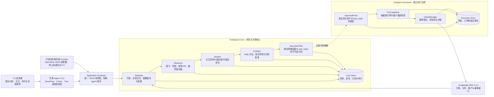

<p align="center">
  
</p>

# TradingCat

[English](README_EN.md)

TradingCat 是一个面向个人投资者的、Agent 无关的量化研究与交易决策系统。它把股票
分析、策略验证、关注监控、Kelly 仓位建议、组合风控和人工审批串成闭环，同时保持
QwenPaw、Codex、Trae 等上层 Agent 可替换。

当前系统处于 **DRY_RUN_ONLY**：研究与真实只读行情已验收，任何实盘订单仍必须经过
独立 executiond、有效的人工 `ApprovalProof`、审批后风控和显式 Live Canary。普通 CLI
不能批准或提交实盘订单。

## 能力概览

- 股票分析：技术因子、数据质量、策略适用性、研究状态与证据血缘。
- 策略研究：预筛、成本模型、嵌套 Walk-Forward、Final Holdout、稳健性评分。
- 关注监控：关注清单、盘前/盘中/盘后检查、买卖区域和保护性止损提醒。
- 持仓管理：收缩 Kelly、目标权重区间、KEEP/ADD/REDUCE/EXIT 建议。
- 安全执行：不可变计划、人工审批、审批后重新风控、幂等订单与券商对账。
- Agent 接入：稳定 JSON stdin/stdout 契约，不依赖任何 Agent SDK 或运行时。

## 系统架构



完整设计见 [架构说明](docs/architecture.md)。

## 快速开始

要求 Python 3.10+。为保证可移植性，项目固定 `longbridge==4.4.3`。

```bash
python3 -m venv .venv
./.venv/bin/pip install -r requirements.txt
cp .env.example .env
# 编辑 .env，填入同一个长桥 Legacy API Key 应用的三项凭证
./.venv/bin/python shared/sdk_diagnostics.py --connect
```

不会读取 Longbridge CLI OAuth token，也不会弹出浏览器认证。SDK 基本面能力按运行时能力探测；
未配置合格的 PIT 数据源时基本面仍明确显示为缺失，技术研究与安全执行链不受影响。

## 个人投资闭环

```bash
# 1. 拉取数据并验证策略
./tc research add AAPL.US
./tc research cache AAPL.US
./tc research prefilter AAPL.US
./tc research run AAPL.US --grid small

# 2. 加入关注并运行监控
./tc subscribe add AAPL.US --push-daily
./tc monitor pre --scope watchlist
./tc monitor intra --scope watchlist
./tc monitor post --scope watchlist

# 3. 查看仓位与组合风险
./tc position --symbol AAPL.US
./tc account sync
./tc risk check

# 4. 生成目标组合和不可变交易计划（不会自动实盘）
./tc portfolio build --equity 100000 --mode DRY_RUN
```

更完整的工作流和命令参数见 [使用说明](docs/usage.md)。

## 接入任意 Agent

Agent 应优先调用稳定 JSON 契约，而不是解析人类可读终端输出：

```bash
printf '{"query":"苹果"}' |
  ./.venv/bin/python -m application.cli analyze-security

printf '{"query":"AAPL","reason":"关注策略验证结果"}' |
  ./.venv/bin/python -m application.cli follow-security

printf '{"account_id":"default"}' |
  ./.venv/bin/python -m application.cli review-portfolio
```

所有响应使用 `tradingcat.v1` envelope，包含 `ok`、`data`、`error`、`warnings` 和
`lineage`。Agent 可以解释和展示结果，但不能伪造审批，也不能绕过 executiond。
完整的意图分发、JSON payload、结果判读和停止规则见
[Agent 集成手册](docs/agent-integration.md)。

## 安全边界

1. AI、策略、监控和调度器都不能直接调用实盘路由。
2. 每个实盘订单必须绑定不可变 `ExecutionPlan.plan_hash` 和真实人工审批证明。
3. 审批后仍须重新执行 PreTradeRisk；任何计划变化都必须重新审批。
4. 账户不同步、订单 UNKNOWN 或对账不一致时，系统禁止新实盘订单。
5. 历史研究只接受具有 `period_end/published_at/available_at/source` 的 PIT 数据。

接入真实资金前必须逐项完成 [实盘 Checklist](docs/live-trading-checklist.md)。

## 验证

```bash
./.venv/bin/python -m pytest -q
./.venv/bin/python e2e_full.py
./.venv/bin/python scripts/acceptance_v5.py
./.venv/bin/python scripts/check_open_source.py
./.venv/bin/python -m build
./.venv/bin/python scripts/check_distribution.py
```

最新自动验收与只读真实数据证据见 [验收记录](docs/acceptance.md)。验收脚本不会创建
Live Canary，也不会提交真实订单。

## 文档

- [架构说明](docs/architecture.md)
- [Agent 集成手册](docs/agent-integration.md)
- [使用说明](docs/usage.md)
- [部署指南](docs/deploy.md)
- [实盘 Checklist](docs/live-trading-checklist.md)
- [验收记录](docs/acceptance.md)
- [开源发布指南](docs/open-source-release.md)
- [贡献指南](CONTRIBUTING.md)
- [安全政策](SECURITY.md)
- [免责声明](DISCLAIMER.md)

## 开源协议

项目采用 [Apache License 2.0](LICENSE)，归属说明见 [NOTICE](NOTICE)。参与贡献即表示
贡献内容按同一协议提供，除非贡献者明确书面标注为 “Not a Contribution”。

TradingCat 与长桥及文中提到的 Agent、数据服务商不存在隶属或背书关系。本项目输出的是
研究与风险决策支持，不构成投资建议；完整说明见 [免责声明](DISCLAIMER.md)。
