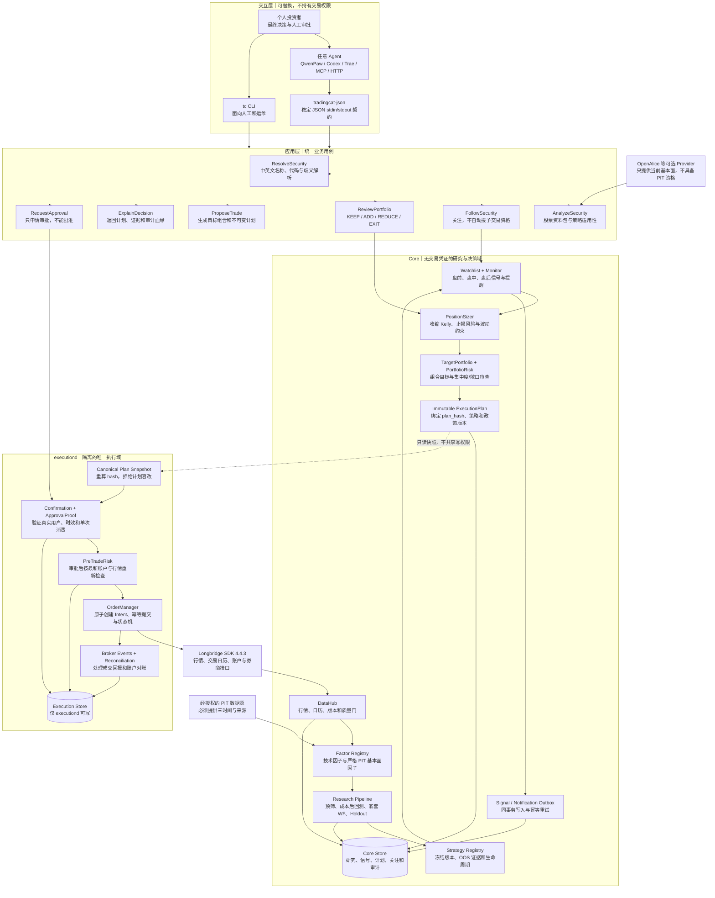
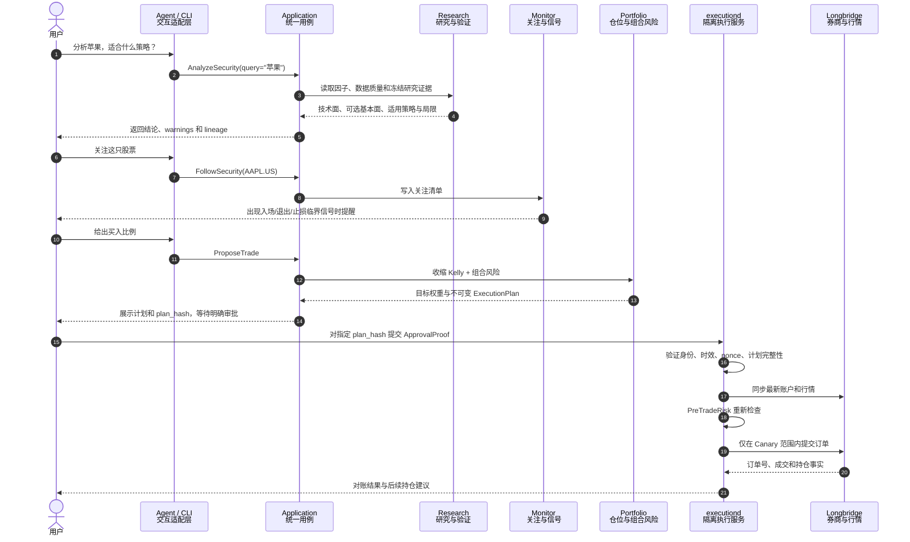

# TradingCat 当前架构

> 状态：当前稳定基线  
> 目标：Agent 无关、个人投资闭环、研究可复现、实盘默认关闭

## 1. 架构目标

TradingCat 不是某个 Agent 的插件后端，而是一个可以独立运行的量化核心。QwenPaw、
Codex、Trae、MCP、HTTP 或普通脚本都只能作为适配层，通过相同 Application Contracts
调用系统。

系统覆盖个人投资者的完整决策闭环：

1. 解析股票并形成技术面、可选基本面和数据质量报告；
2. 通过成本后回测、嵌套 Walk-Forward 和 Final Holdout 验证候选策略；
3. 把通过验证的股票加入关注清单，持续检测入场、退出和止损信号；
4. 根据冻结 OOS 证据、止损距离和组合限制给出目标仓位；
5. 用户明确审批不可变计划后，由隔离执行服务重新风控并路由订单；
6. 依据真实账户、成交回报和卖出信号持续管理持仓。

## 2. 总体模块图



## 3. 个人投资流程



关注不等于交易资格，策略验证通过也不等于资金授权。三者分别由 Watchlist、Strategy
Lifecycle 和 ApprovalProof 管理，不能互相推导。

## 4. 研究可信性

研究链固定为：

```mermaid
flowchart LR
    INPUT["候选标的"] --> PREFILTER["预筛<br/>数据量、流动性、新鲜度、OHLC 合法性"]
    PREFILTER --> CACHE["版本化数据缓存<br/>来源、复权模式、SHA-256"]
    CACHE --> DEV["Development 区<br/>参数探索与内层验证"]
    DEV --> OUTER["Nested Walk-Forward<br/>外层 OOS 只用于评估"]
    OUTER --> ROBUST["稳健性门<br/>成本、折间一致性、参数扰动"]
    ROBUST --> HOLDOUT["Final Holdout<br/>候选冻结后只暴露一次"]
    HOLDOUT --> VERSION["StrategyVersion<br/>固化代码、数据、参数和 OOS 证据"]
    VERSION --> LIFE["Lifecycle<br/>verified / degraded / suspended / removed"]
```



关键约束：

- 全样本收益不能证明策略有效，仓位模型只读取冻结的 OOS 统计；
- 同一个 Holdout 不得因换参数重复暴露，崩溃也不能绕过消费记录；
- 成本模型包括手续费、点差、滑点、市场冲击和最小交易单位；
- Longbridge Quant 与 vectorbt 只允许作为探索或交叉验证，最终资格由 Native 引擎决定；
- 数据源或复权方法改变时整段替换并生成新版本，禁止拼接历史。

## 5. 因子与基本面边界

技术因子包括趋势、动量、波动、均线距离、RSI、ADX 和成交额流动性。基本面被硬拆成
两条契约：

- `CurrentFundamentalProvider`：仅回答“现在公司怎么样”，可以由 OpenAlice JSON
  adapter 等外部来源提供；不得写入历史因子表。
- `FundamentalPITProvider`：仅供历史研究，必须同时提供 `period_end`、
  `published_at`、`available_at` 和 `source`，缺一即拒绝。

项目固定 `longbridge==4.4.3`。长桥基本面接口按能力探测；只有满足时间有效性和来源要求的
PIT 数据才进入研究链。未配置合格 Provider 时明确返回 `MISSING_SAFE_DEGRADE`，不会调用
CLI/OAuth，也不会生成伪值。

## 6. 仓位与组合决策

单标的建议取以下约束的最小值：

- 冻结 OOS 交易分布计算的收缩 Kelly；
- 单笔止损风险预算；
- 波动目标与单标的权重上限；
- 流动性与 ADV 容量。

TargetPortfolio 再检查总名义敞口、止损风险、行业/币种集中度、相关性、Beta、杠杆、
事件风险、购买力和 pending orders。组合审查失败时，拟议新仓目标归零，现有持仓仍
保留退出和降风险路径。

## 7. 执行安全模型

实盘状态机固定为：

```text
Signal → PositionIntent → TargetPortfolio → PortfolioRisk
→ immutable ExecutionPlan(plan_hash)
→ PENDING Confirmation
→ user ApprovalProof
→ PreTradeRisk(PASS/REJECT)
→ OrderManager
→ LiveBroker
→ BrokerAck / Fill / Reconciliation
```

不可违反的约束：

1. Core 不持有交易凭证，也不能写 execution store；
2. executiond 只读取 Core 的计划快照，重算 hash 后复制到自己的存储；
3. AI 和 CLI 只能申请审批，不能生成 LIVE `APPROVED`；
4. Confirmation 对 plan_hash 单次消费，超时、重放或计划变化都失效；
5. PreTradeRisk 只能 PASS/REJECT，不能修改已批准订单；
6. OrderIntent 与 Confirmation 消费必须在同一事务内；
7. 账户非 SYNCED、订单 UNKNOWN 或对账 MISMATCH 时 fail closed；
8. 普通 LIVE 永久默认关闭，只能在人工创建且受限的 Live Canary 中测试。

## 8. 数据与进程边界

| 边界 | 写入者 | 内容 |
|---|---|---|
| Core Store | TradingCat Core | 行情缓存、研究证据、策略版本、关注、信号、计划、审计 |
| Execution Store | executiond | Confirmation、ApprovalProof、OrderIntent、BrokerAck、Fill、对账 |
| Longbridge | SDK 4.4.3 | 行情、日历、账户状态和券商事实；基本面能力按需探测 |
| Reports | monitor/subscribe | 人类可读与机器可读报告，不作为交易真相源 |

所有 SQLite 访问都通过 `shared/db.py` 的 StateRepository 能力，启用 WAL、外键、
busy timeout 和短事务。在线备份使用 SQLite Backup API，不能直接复制活动中的 WAL
数据库。

## 9. Agent 无关契约

`application/contracts.py` 提供以下稳定用例：

| 操作 | 用途 | 是否可能实盘 |
|---|---|---|
| ResolveSecurity | 名称/代码解析 | 否 |
| AnalyzeSecurity | 股票分析与策略适用性 | 否 |
| FollowSecurity | 加入关注清单 | 否 |
| ReviewPortfolio | 持仓与目标权重建议 | 否 |
| ProposeTrade | 生成不可变计划 | 否 |
| ExplainDecision | 查询计划和血缘 | 否 |
| RequestApproval | 创建 PENDING 审批请求 | 否 |

JSON envelope 版本为 `tradingcat.v1`。上层 Agent 只需调用这些用例，无需 import QwenPaw
或其他 Agent SDK；迁移系统时复制目录、安装依赖和配置环境变量即可。

## 10. 代码模块映射

| 模块 | 责任 |
|---|---|
| `application/` | Agent 无关业务用例和 JSON adapter |
| `shared/` | Longbridge 适配、数据库、指标、成本、日历和回测接口 |
| `research/` | 因子、预筛、Walk-Forward、Holdout、稳健性和评分 |
| `production/` | 关注监控、仓位、组合风控、决策与运维 |
| `execution/` | 审批证明、风控、订单状态机、券商回报和对账 |
| `scripts/` | 自动验收与真实只读个人闭环验证 |
| `deploy/` | cron/systemd 模板；不修改 QwenPaw |

## 11. 当前运行状态

- SDK：正式支持且固定为 `longbridge==4.4.3`；
- 行情：AAPL 真实只读连接已通过；
- 基本面：默认安全缺失，可选 OpenAlice current-only adapter；
- 研究/监控/组合/DRY_RUN：自动验收通过；
- P0-A：仍需在目标机器人工确认独立 OS 用户和数据库权限；
- P0-B：没有用户逐笔授权，因此未执行真实极小额订单；
- 系统状态：`DRY_RUN_ONLY`。

准确验收结果以 [acceptance.md](acceptance.md) 为准。
