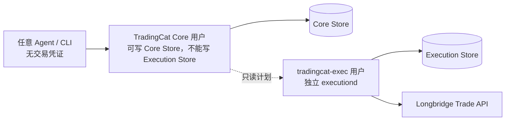

# TradingCat 部署指南

TradingCat 可以独立部署，不需要修改 QwenPaw、AgentScope 或其他 Agent 容器。

## 1. 运行要求

- Python 3.10+
- 可访问长桥 OpenAPI 的网络
- 长桥 Legacy API Key 三凭证
- 生产执行时：独立 Core/Execution 数据库路径和独立 executiond OS 用户

```bash
cd /opt/tradingcat
python3 -m venv .venv
./.venv/bin/pip install -r requirements.txt
cp .env.example .env
```

项目固定 `longbridge==4.4.3`，不需要 Rust、源码编译或定制 QwenPaw 镜像。

## 2. 配置

最小只读配置：

```dotenv
LONGBRIDGE_APP_KEY=...
LONGBRIDGE_APP_SECRET=...
LONGBRIDGE_ACCESS_TOKEN=...
```

推荐的生产隔离配置：

```dotenv
LONGBRIDGE_QUOTE_APP_KEY=...
LONGBRIDGE_QUOTE_APP_SECRET=...
LONGBRIDGE_QUOTE_ACCESS_TOKEN=...
LONGBRIDGE_TRADE_APP_KEY=...
LONGBRIDGE_TRADE_APP_SECRET=...
LONGBRIDGE_TRADE_ACCESS_TOKEN=...
TRADINGCAT_REQUIRE_SEPARATE_CREDENTIALS=1

TRADING_CORE_DB=/var/lib/tradingcat/core/trading.db
TRADING_EXECUTION_DB=/var/lib/tradingcat/execution/execution.db
TRADINGCAT_RUNTIME_DIR=/var/lib/tradingcat
TRADINGCAT_REPORTS_DIR=/var/lib/tradingcat/reports
TRADINGCAT_BACKUP_DIR=/var/lib/tradingcat/backups
```

可选变量见 [.env.example](../.env.example)。只有长桥明确要求时才覆盖
`LONGBRIDGE_HTTP_URL`、`LONGBRIDGE_QUOTE_WS_URL` 或 `LONGBRIDGE_TRADE_WS_URL`。

## 3. 部署形态



P0-A 验收要求：

1. Core 和 executiond 使用不同 OS 用户；
2. Core 对 execution store 无读写权限；
3. executiond 对 Core store 只有读取计划所需的最小权限；
4. 交易凭证只注入 executiond；
5. executiond 服务启用 `ProtectSystem=strict` 等 systemd 沙箱选项。

参考模板：`deploy/systemd/tradingcat-executiond.service`。

### P0-A Linux/systemd 现场部署

以下命令只读取本机 systemd、文件所有者/权限、环境文件中的**变量名**和 executiond 的
`health` socket RPC；不会连接 Longbridge、创建 Canary 或提交订单。生产主机需先创建
`tradingcat-core`、`tradingcat-exec`、`tradingcat-core-read` 和 `tradingcat-exec-client`，其中
Core 用户只加入 socket client 组，executiond 用户加入 core read 与 socket client 组。

```bash
sudo install -d -o tradingcat-core -g tradingcat-core-read -m 0750 /var/lib/tradingcat/core
sudo install -d -o tradingcat-exec -g tradingcat-exec -m 0700 /var/lib/tradingcat/execution
sudo install -o tradingcat-core -g tradingcat-core-read -m 0640 /dev/null /var/lib/tradingcat/core/core.db
sudo install -o tradingcat-exec -g tradingcat-exec -m 0600 /dev/null /var/lib/tradingcat/execution/execution.db
sudo install -o root -g tradingcat-exec -m 0640 /dev/null /etc/tradingcat/executiond.env
sudo systemctl daemon-reload
sudo systemctl enable --now tradingcat-executiond.service

./.venv/bin/python scripts/deployment_readiness.py
```

现场验收仅在 Linux 且 systemd 运行、服务 active 时返回 `PASS`。在 Windows、macOS、容器中
没有 systemd，或无法读取现场信息时返回 `NOT_RUN`/`FAIL`，不得据此记录 P0-A。

## 4. 调度

`deploy/` 提供两种独立于 Agent 的调度方式：

- `deploy/crontab.example`：适合单机个人部署；
- `deploy/systemd/tc-*.service`、`tc-schedule.timer`：适合长期运行。

部署模板前替换其中的 `${TS_ROOT}`、数据库路径和 OS 用户。调度只运行研究、监控、
报告、同步、对账和备份，不创建 Live Canary，也不自动提交实盘订单。

## 5. 安装后验证

运行测试的机器额外安装开发依赖：

```bash
./.venv/bin/pip install -r requirements-dev.txt
```

```bash
cd /opt/tradingcat
./.venv/bin/python -m pip check
./.venv/bin/python shared/sdk_diagnostics.py --connect
./.venv/bin/python -m pytest -q
./.venv/bin/python e2e_full.py
./.venv/bin/python scripts/acceptance_v5.py
```

未通过 Linux/systemd 现场验收时，不要使用 `--record-p0a`。完成真实部署检查后才可运行：

```bash
./.venv/bin/python scripts/acceptance_v5.py \
  --deployment-readiness --record-p0a
```

这只记录 P0-A readiness，不会创建 Canary 或提交订单。

## 6. 备份与迁移

在线运行时使用：

```bash
./tc backup daily
./tc backup weekly
```

不要直接复制仍在 WAL 模式运行的数据库。整机迁移流程为：停止 TradingCat 服务、完成
checkpoint/备份、复制项目与数据目录、重新安装 requirements、注入环境变量并重新验收。

QwenPaw、Codex 或 Trae 只需重新指向 `./tc` 或 `python -m application.cli`，不需要把
TradingCat 编译进 Agent 镜像。

## 7. 实盘边界

部署完成不等于允许实盘。P0-B 仍要求用户明确给出账户、标的、方向、最大名义金额、
最大订单数和有效期，并逐笔提交 ApprovalProof。详见
[live-trading-checklist.md](live-trading-checklist.md)。
